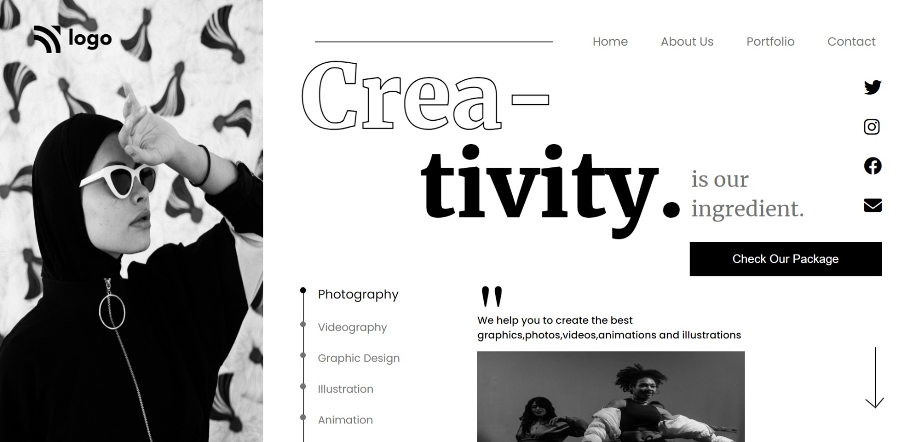
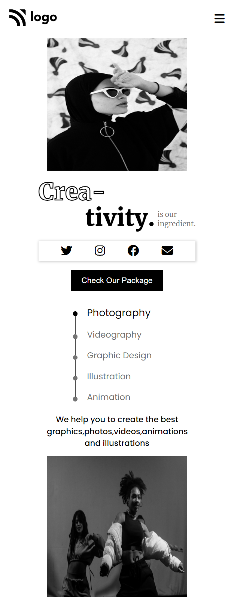

## PROJECT NAME: Dance Home Page

### **💻TECH STACK USED IN THIS PROJECT:** 
- 
- 

### **🛠WHAT I HAVE LEARNT IN THIS PROJECT:** 
- Media Queries
- z-index
- webkit-text-stroke property
- Pseudo elements(before,after)
- tranform property
- Box Shadow
- Absolute Positioning 
- Paddings and Margins
- CSS Selectors
- CSS Flex-box

### **⌛TIME TAKEN TO COMPLETE THIS PROJECT:** 
- I have taken 3 hours to complete this project.

### **👀SCREEN CAPTURE IN LAPTOP SCREEN:**

### **👀SCREEN CAPTURE IN MOBILE SCREEN:**

### 💻📱I have made this project responsive in both **laptop** screen and **mobile** screen

### **🚀LIVE LINK:**
-  This project is hosted on **Netlify**.You can Check it live using below link: 
-  [Project Live Link !](https://631edf227bc2085babcd740d--precious-starlight-b7b2ab.netlify.app/)

